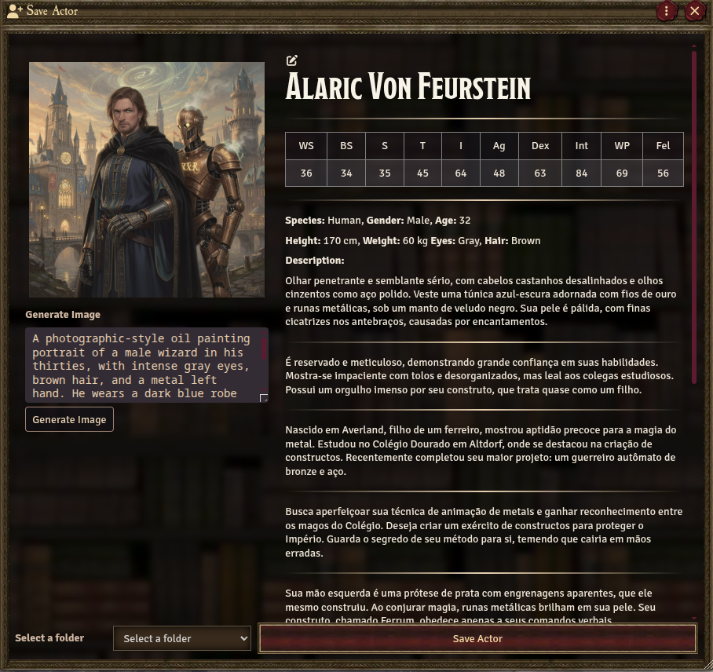
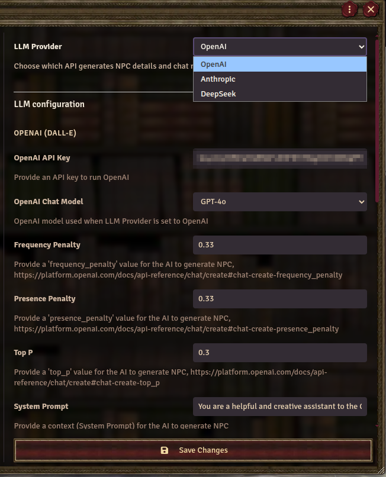
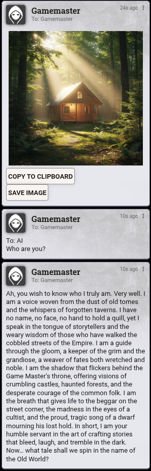
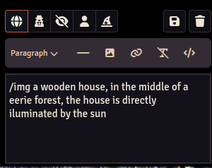
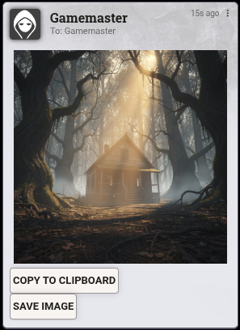

# AI Generated NPCs

AI Generated NPCs is a Foundry VTT module that creates detailed NPCs using an LLM (OpenAI, Anthropic, or DeepSeek) and generates portraits via OpenRouter or OpenAI DALL-E.

Repository: [ricardopiloto/ai-actors](https://github.com/ricardopiloto/ai-actors)



## Compatibility

| | |
|---|---|
| **Foundry VTT** | v13–v14 |
| **Game systems** | [WFRP 4e](https://foundryvtt.com/packages/wfrp4e) (`wfrp4e`), [D&D 5e](https://foundryvtt.com/packages/dnd5e) (`dnd5e`) |
| **Languages** | English, Polish, French |

The module detects the active system automatically (`game.system.id`) and adapts the input form, LLM prompts, preview, and created Actor sheet.

### WFRP 4e

Generates characteristics, careers, talents, wounds, and species data aligned with WFRP4e rules. Input fields include number of careers and talents.

### D&D 5e

Supports two NPC types:

- **Character with Class** — SRD classes, ability scores, feats, and skills. Class level can be set in the form, parsed from the description, or defaults to 1 when omitted.
- **Creature (Challenge Rating)** — creature type, CR, AC, and HP for stat-block style NPCs.

D&D content is limited to the **SRD** (no compendium lookups). D&D-specific UI strings are in English only (`en.json`).

## Installation

1. Install the module in Foundry (manifest URL from the [releases page](https://github.com/ricardopiloto/ai-actors/releases)).
2. Enable **AI Generated NPCs** in your world.
3. Open **Configure Settings → Module Settings → AI Generated NPCs** and set at least one LLM provider (and image provider, if you want portraits).

## Generating an NPC

In the **Actors** directory, click **Generate AI NPC** (GM only).

1. Enter a short description and choose a **details complexity** (simple / medium / complex).
2. Fill in any system-specific fields (WFRP careers/talents, or D&D NPC type, class level, CR, etc.).
3. Click **Send to AI**. Generation runs in stages and may take a minute.
4. Review the preview (description, stats, and portrait). Edit the image prompt and use **Generate Image** if you want a different portrait.
5. Optionally pick a folder, then click **Save Actor**.

Windows resize automatically to fit their content.


## Settings

Configure the module under **Configure Settings → Module Settings → AI Generated NPCs**. Settings are grouped by provider; only fields relevant to the selected LLM and image provider are shown.



### LLM (NPC text and chat)

Choose one provider and set its API key and model:

| Provider | Notes |
|---|---|
| **OpenAI** | Default. Also used for shared options (system prompt, temperature, max tokens). |
| **Anthropic** | Claude models via Anthropic API. |
| **DeepSeek** | e.g. `deepseek-chat`. |

You will need an API key from your chosen provider (e.g. [OpenAI](https://platform.openai.com/api-keys), [Anthropic](https://console.anthropic.com/), [DeepSeek](https://platform.deepseek.com/)).

The **system prompt** should match your game system and language. Example for WFRP 4e in English:

```
You are a helpful and creative assistant to the Game Master in 4th Edition Warhammer Fantasy RPG. You help by providing descriptions and basic characteristics for NPCs, description of places, stories and adventures. Use the lore and history of Warhammer Fantasy World and be inspired by other fantasy literature or movies. Use an artistic style based on novels and stories. Do not use calculations and bullet points.
```

Polish and French WFRP examples from the original module:

```
Jesteś pomocnym i kreatywnym asystentem Mistrza Gry w 4. edycji Warhammer Fantasy RPG. Pomagasz, podając opisy i podstawowe cechy dla Bohaterów Niezależnych, opisy miejsc, wydarzeń oraz przygód. Korzystaj z opisu świata i historii Warhammer Fantasy, korzystaj z inspiracji innymi dziełami literatury fantasy. Używaj systemu metrycznego. Używaj stylu artystycznego, typowego dla powieści i opowiadań. Nie kopiuj zwrotów użytych w zapytaniu. Nie używaj wyliczeń i wypunktowań.
```

```
Vous êtes un assistant utile et créatif du Maitre de Jeu dans la 4e édition de Warhammer Fantasy RPG. Vous aidez en fournissant des descriptions et des caractéristiques de base pour les PNJ, des descriptions de lieux, des histoires et des aventures. Utilisez les traditions et l'histoire de Warhammer Fantasy World et laissez-vous inspirer par d'autres littératures ou films fantastiques. Utilisez un style artistique basé sur des romans et des histoires. N'utilisez pas de calculs ni de puces.
```

### Image generation

| Provider | Notes |
|---|---|
| **OpenRouter** | Default. Supports many image models via [OpenRouter](https://openrouter.ai/). |
| **OpenAI** | DALL-E via OpenAI API key. |

Portrait prompts are validated against content policies before being sent to the API. Non-compliant prompts are adjusted automatically when possible.

Set **Image Folder Location** to control where saved portraits are stored in your Foundry data.

## Chat commands

Use the chat to interact with the configured LLM or image provider without opening the NPC workflow. Responses are posted as **private messages** visible only to you.

`ai`, `img`, and `gpt-reset` are **virtual recipients** — they are not Foundry users. The module intercepts these before the core whisper handler runs (including on Foundry v14).

| Command | Description |
|---|---|
| `/whisper ai <prompt>` | Generate text with the configured LLM and system prompt |
| `/w ai <prompt>` | Short alias for the above |
| `/ai <prompt>` | Direct shortcut (no whisper prefix) |
| `/whisper img <prompt>` | Generate an image with the configured image provider |
| `/w img <prompt>` | Short alias for the above |
| `/img <prompt>` | Direct shortcut (no whisper prefix) |
| `/whisper gpt-reset` | Clear the in-session AI conversation history |

### Text chat (`/whisper ai` or `/ai`)

Conversation context is kept for the session (until reload). A longer **message history** setting preserves more context but increases API cost. Set history length to `0` or run `/whisper gpt-reset` to clear it.



### Image chat (`/whisper img` or `/img`)

Generates an image from the description. You can save the image or copy it to the clipboard (clipboard may require HTTPS).




## Contributing

This module is under active development. Bug reports, feature suggestions, and pull requests are welcome — especially adapters for additional game systems.

## Credits

Inspired by [Rachel Schutz](https://github.com/rachsg7)'s original module.

Maintained by [Ricardo Sobral](https://github.com/ricardopiloto).

## Roadmap

- Save NPCs and their prompts as Journal Pages
